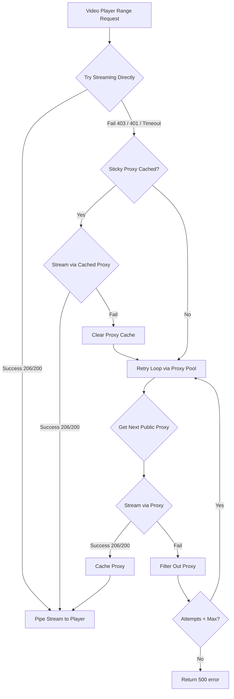

# Self-Healing Python Video Proxy Pattern
This design pattern provides an optimistic, self-healing video streaming reverse proxy built in Python. It supports **HTTP Range Requests (status code 206)** for chunk-by-chunk media playback and rotates through a public proxy pool if the video host blocks the direct network IP (e.g. data center blocks on AWS, GCP, Heroku, or Render).

---

## Core Architecture for Video Chunks



### Key Technical Rules for Video Chunking
1. **Range Header Forwarding:** The client browser sends a `Range: bytes=X-Y` header. You **must** read and forward this header to the video host so that the host only sends the requested bytes.
2. **Range Response Headers:** The video host returns status `206 Partial Content` (or `200 OK` for the first load) along with headers: `Content-Range`, `Content-Length`, `Content-Type`, and `Accept-Ranges`. You **must** forward these exact headers back to the browser player.
3. **Chunked Streaming Response:** You must read the incoming video bytes asynchronously in small buffers (e.g., 64KB chunks) and stream them back to the client immediately using a generator to prevent memory bloat.

---

## FastAPI (Async HTTPX) Implementation

Below is a complete, production-grade Python script using **FastAPI** and **HTTPX**:

```python
import httpx
import random
import time
from typing import AsyncGenerator
from fastapi import FastAPI, Request, Response
from fastapi.responses import StreamingResponse

app = FastAPI()

# Sticky active proxy agent states
active_proxy: str = None
proxies_list: list[str] = []
last_proxy_fetch_time = 0.0

async def get_proxy_url() -> str:
    """
    Fetches and cache Elite SSL public proxies from target low-latency regions.
    """
    global active_proxy, proxies_list, last_proxy_fetch_time
    if active_proxy:
        return active_proxy

    now = time.time()
    if not proxies_list or (now - last_proxy_fetch_time > 300):
        try:
            # Fetch high-speed Elite proxies in US, Germany, UK, and Canada
            async with httpx.AsyncClient(timeout=5.0) as client:
                res = await client.get(
                    "https://api.proxyscrape.com/v2/?request=displayproxies&protocol=http&timeout=5000&country=US,DE,GB,CA&ssl=yes&anonymity=elite"
                )
                proxies = [p.strip() for p in res.text.split("\r\n") if p.strip()]
                if proxies:
                    proxies_list = proxies
                    last_proxy_fetch_time = now
        except Exception:
            # Fallback source if proxy-scrape is down
            try:
                async with httpx.AsyncClient(timeout=4.0) as client:
                    res = await client.get("https://raw.githubusercontent.com/monosans/proxy-list/main/proxies/http.txt")
                    proxies = [p.strip() for p in res.text.split("\n") if p.strip()]
                    if proxies:
                        proxies_list = proxies
                        last_proxy_fetch_time = now
            except Exception:
                pass

    if proxies_list:
        selected = random.choice(proxies_list[:30])  # Select from the top 30 fastest
        active_proxy = f"http://{selected}"
        return active_proxy
    return None

@app.get("/video-proxy")
async def video_proxy(url: str, request: Request, referer: str = None):
    global active_proxy, proxies_list
    
    # 1. Forward the Range and browser headers
    range_header = request.headers.get("range")
    headers = {
        "User-Agent": "Mozilla/5.0 (Windows NT 10.0; Win64; x64) AppleWebKit/537.36...",
        "Referer": referer or "https://google.com"
    }
    if range_header:
        headers["Range"] = range_header

    # Helper function to generate chunks for the client response
    async def stream_media(client: httpx.AsyncClient, response: httpx.Response) -> AsyncGenerator[bytes, None]:
        try:
            async for chunk in response.aiter_bytes(chunk_size=1024 * 64): # Stream in 64KB chunks
                yield chunk
        finally:
            await response.aclose()
            await client.aclose()

    # 2. Try utilizing the cached working proxy first
    if active_proxy:
        try:
            proxy_client = httpx.AsyncClient(proxies={"all://": active_proxy}, timeout=10.0)
            req = proxy_client.build_request("GET", url, headers=headers)
            resp = await proxy_client.send(req, stream=True)
            
            if resp.status_code in [200, 206]:
                resp_headers = {h: resp.headers[h] for h in ["content-type", "content-length", "content-range", "accept-ranges"] if h in resp.headers}
                return StreamingResponse(stream_media(proxy_client, resp), status_code=resp.status_code, headers=resp_headers)
        except Exception:
            if active_proxy:
                failed_ip = active_proxy.replace("http://", "")
                proxies_list = [p for p in proxies_list if p != failed_ip]
            active_proxy = None

    # 3. Direct Optimistic Request attempt
    try:
        direct_client = httpx.AsyncClient(timeout=6.0)
        req = direct_client.build_request("GET", url, headers=headers)
        resp = await direct_client.send(req, stream=True)
        
        if resp.status_code in [200, 206]:
            resp_headers = {h: resp.headers[h] for h in ["content-type", "content-length", "content-range", "accept-ranges"] if h in resp.headers}
            return StreamingResponse(stream_media(direct_client, resp), status_code=resp.status_code, headers=resp_headers)
        
        # If directly blocked, close and raise to trigger proxy rotation
        await resp.aclose()
        await direct_client.aclose()
        if resp.status_code in [403, 401]:
            raise httpx.HTTPStatusError("Blocked by host", request=req, response=resp)
            
    except (httpx.HTTPError, httpx.HTTPStatusError):
        # 4. Fallback retry loop via rotated public proxies
        for _ in range(5):
            p_url = await get_proxy_url()
            if p_url:
                try:
                    proxy_client = httpx.AsyncClient(proxies={"all://": p_url}, timeout=10.0)
                    req = proxy_client.build_request("GET", url, headers=headers)
                    resp = await proxy_client.send(req, stream=True)
                    
                    if resp.status_code in [200, 206]:
                        active_proxy = p_url # Cache the successful proxy
                        resp_headers = {h: resp.headers[h] for h in ["content-type", "content-length", "content-range", "accept-ranges"] if h in resp.headers}
                        return StreamingResponse(stream_media(proxy_client, resp), status_code=resp.status_code, headers=resp_headers)
                    
                    await resp.aclose()
                    await proxy_client.aclose()
                except Exception:
                    failed_ip = p_url.replace("http://", "")
                    proxies_list = [p for p in proxies_list if p != failed_ip]
                    active_proxy = None

    return Response("Video streaming request failed", status_code=500)
```
